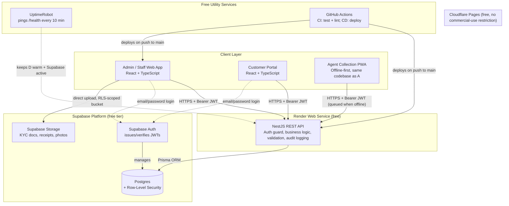

# 02 — System Architecture & Tech Stack

## 1. High-Level Architecture



**Request flow, concretely:** the browser holds a Supabase session (access token + refresh token, managed by the Supabase JS client). Every call to the Pigmie API attaches the access token as `Authorization: Bearer <jwt>`. The NestJS API verifies that JWT's signature against Supabase's public JWKS (no round-trip to Supabase needed per-request), extracts the user's `sub` (their `auth.users.id`), looks up their `staff` or `customers` row to resolve `organization_id` and `role`, and only then executes the request — scoping every query by that `organization_id`. Postgres RLS policies enforce the same scoping a second time at the data layer, so a bug in the API's authorization code is not the only thing standing between one organization's data and another's.

## 2. Component Responsibilities

| Component | Responsible for | Not responsible for |
|---|---|---|
| **React frontend(s)** | Rendering, client-side validation (UX only), offline queueing (agent app), calling the API | Business logic, authorization decisions, direct writes to the database |
| **NestJS backend** | All business logic, validation, authorization, audit logging, PDF/report generation, scheduled jobs | Rendering, storing files itself (delegates to Supabase Storage) |
| **Supabase Auth** | Password hashing, session/JWT issuance and refresh, password reset flow, optional magic links | Business authorization (role/permission logic lives in the backend + RLS, not in Supabase Auth) |
| **Supabase Postgres** | System of record, RLS enforcement as defense-in-depth | — |
| **Supabase Storage** | Binary file storage with per-bucket RLS policies | Business logic about *when* a file may be uploaded (backend still validates before issuing an upload path where extra checks are needed) |

## 3. Tech Stack — Decisions & Reasoning

Every choice below was checked against currently published free-tier terms (August 2026), not assumed from memory, because free-tier terms are exactly the kind of thing that quietly changes.

| Layer | Choice | Why | Free tier facts that mattered |
|---|---|---|---|
| **Frontend framework** | React 18 + TypeScript, built with Vite | Largest ecosystem, easiest hiring, Vite gives fast dev/build without a heavier meta-framework Pigmie doesn't need (no SSR requirement — it's an authenticated app, not a public content site) | N/A — it's just code you own |
| **Frontend hosting** | **Cloudflare Pages** | Unlimited bandwidth, no commercial-use restriction, automatic HTTPS, global CDN, 500 builds/month | Verified: Cloudflare Pages free tier explicitly permits commercial use and has no bandwidth cap, unlike the alternative below |
| ~~Frontend hosting~~ | ~~Vercel Hobby~~ (rejected) | Excellent DX, but — | **Vercel's Hobby plan Terms of Service explicitly prohibit commercial use**, defined broadly enough to include "generating revenue for anyone involved, including a paid employee writing the code." A lending operation is commercial by definition, even if only used internally. Using Hobby here would mean building on a tier you're not actually licensed to run this app on. Vercel Pro is a fine choice later if you want it, at $20/seat/month. |
| **UI components / styling** | Tailwind CSS + shadcn/ui | Utility-first CSS with a design-token approach avoids "generic AI/bootstrap look"; shadcn/ui ships as copy-in source, not an npm dependency with its own release cadence — you own and can modify every component | Free, open source, MIT-licensed |
| **State management** | TanStack Query (server state) + Zustand (local UI state) | Server state (loans, customers, collections) is cached/synced data, not app state — treating it that way (via Query) eliminates a whole class of stale-data bugs. Zustand for the small amount of genuine client-only state (sidebar open/closed, offline queue status) | Free, open source |
| **Backend framework** | NestJS + TypeScript | Structured, dependency-injected, and its Guards/Interceptors/Pipes map directly onto auth/validation/audit-logging concerns a financial records app needs — much less ad hoc than bare Express for this scope | N/A |
| **ORM** | Prisma | Type-safe queries generated from schema, first-class migration tooling, parameterized queries by default (SQL-injection-safe), works cleanly against Supabase's standard Postgres connection string | Free, open source |
| **Backend hosting** | **Render (free Web Service)** | Deploys straight from Git, free TLS, genuinely $0 for a service within the free instance-hours budget | Verified: 512MB RAM / 0.1 CPU, 750 free instance-hours/month (≈ a full month if kept warm), spins down after 15 min idle with a 30–60s cold start on next request — mitigated in §8 below |
| **Database + Auth + Storage** | **Supabase** | One free account gives Postgres (with RLS), a mature Auth service (password hashing, JWT issuance, refresh, reset flows — all things you'd otherwise hand-roll and risk getting wrong), and object storage, all wired together | Verified: 500MB DB storage, 1GB file storage, 5GB egress, 50,000 MAU, 500K edge function invocations, 2 active projects — free projects **pause after 7 days with zero requests** (mitigated in §8) |
| ~~Database~~ | ~~Render Postgres~~ (rejected as primary) | Same dashboard as the backend host, tempting | **Free Render Postgres instances are deleted after 30 days**, full stop, no grace beyond a 14-day warning window. Not viable as a system of record under any circumstance. |
| **Alternative DB worth knowing** | Neon (Postgres) | If you'd rather have "just a database" and build your own auth, Neon's free tier never expires and auto-suspends/resumes in under a second (no manual dashboard unpause, unlike Supabase) | 0.5GB storage/project, 100 compute-hours/month, up to 20 projects, commercial use allowed. Documented here as the fallback if you outgrow Supabase's bundled-auth model and want to decouple the database. |
| ~~Database~~ | ~~Firebase / Firestore~~ (rejected) | User-named option, addressed for completeness | Firestore is a NoSQL document store. A loan ledger needs strict relational integrity and multi-row transactions (recording one collection must atomically update the schedule row, the loan's outstanding balance, and write an audit log entry) — this is native to Postgres and awkward to guarantee correctly in Firestore's document model. Firebase remains a reasonable choice if this were a simpler, less transactional app; it is not the better fit here. |
| **CI/CD** | GitHub Actions | Free and unlimited for public repos; 2,000 free minutes/month for private repos, which is more than enough for lint+test+deploy on every push at this project's scale | Verified against 2026 pricing |
| **Keep-alive / uptime** | UptimeRobot (free) | Purpose-built for exactly this — pinging a URL on an interval, free forever at 5-minute granularity | This is the tool for high-frequency pinging; GitHub Actions is not (see §8 for why) |
| **PDF generation** | `pdf-lib` or `@react-pdf/renderer`, run inside the NestJS backend | Pure-JS, no external service, no per-document fee | Free, open source |
| **2FA** | TOTP via `otplib`, backend-generated/verified | No SMS gateway, works with any standard authenticator app | Free, open source |
| **Push notifications (optional, Phase 3)** | Web Push (VAPID), via the `web-push` npm package | Uses the browser's native push standard — no third-party push service, no per-message cost | Free |
| **Error tracking (optional)** | Sentry free tier | 5,000 errors/month free at time of writing — genuinely useful for a records system where silent failures matter; verify current limits at sentry.io before relying on it | Optional, not load-bearing to the free-cost claim |

## 4. Multi-Tenancy Strategy — the Load-Bearing Part at This Scale

Because Pigmie is one deployment serving many organizations, tenant isolation is the core security property of the product, not a nice-to-have. Every business table carries `organization_id`, enforced by two layers that are **both** load-bearing:

1. **Application layer:** the NestJS backend resolves the caller's `organization_id` from their verified JWT + profile lookup once per request, and every Prisma query is scoped with `where: { organizationId: ctx.organizationId, ... }` via a shared query-scoping helper (`08-backend-implementation-guide.md §3`).
2. **Database layer, made genuinely load-bearing, not just a backstop:** the backend connects to Postgres using a dedicated `pigmie_app` role that does **not** bypass RLS (unlike Supabase's default `service_role`, which does). At the start of every request's database transaction, the backend executes `select set_config('app.current_org_id', $1, true)` with the caller's already-resolved `organization_id`. RLS policies check this session-scoped setting via `public.request_organization_id()` (defined in `03-database-schema.md §5`), so **a missing `organizationId` filter in application code is still blocked by Postgres itself.** That's the difference between "RLS as a backstop for one operator's own branches" and "RLS as the actual security boundary between unrelated businesses" — and it's the correct posture given the scale this is built for. A code review miss becomes a caught bug, not a breach.

**Connection pooling is not optional at this scale.** A backend serving concurrent requests from many organizations at once will exhaust Postgres's direct-connection limit fast if each request holds its own connection. Prisma's `DATABASE_URL` must point at Supabase's **pooled** connection string (port `6543`, PgBouncer in transaction mode) for all runtime queries; the **direct** connection (port `5432`) is reserved for running migrations only, via Prisma's separate `directUrl` setting in `schema.prisma` (Prisma supports this split natively — it's not a workaround).

**Per-tenant rate limiting, not just per-IP.** One organization running a large bulk import or a misbehaving integration shouldn't be able to degrade response times for every other organization sharing the same free-tier compute. Rate limits (`06-security-architecture.md §7`) are keyed by `organization_id` in addition to IP, specifically because "many users" here means many *independent* users whose experience of the platform shouldn't depend on how heavily some other tenant is using it at the same moment.

## 5. Repository Structure

Two repositories (polyrepo), because frontend and backend deploy independently to different providers with different CI pipelines — a monorepo buys nothing here and adds tooling overhead (path-based CI triggers, shared build caching) that isn't needed at this scale.

**`pigmie-api` (NestJS backend):**
```
pigmie-api/
├── src/
│   ├── main.ts
│   ├── app.module.ts
│   ├── common/
│   │   ├── decorators/          # @CurrentUser(), @Roles()
│   │   ├── guards/               # SupabaseAuthGuard, RolesGuard
│   │   ├── interceptors/         # AuditLogInterceptor
│   │   ├── filters/               # HttpExceptionFilter
│   │   └── pipes/                 # ValidationPipe config
│   ├── config/                    # env validation (Zod-validated config module)
│   ├── prisma/
│   │   ├── prisma.service.ts
│   │   └── schema.prisma
│   ├── modules/
│   │   ├── auth/
│   │   ├── organizations/
│   │   ├── staff/
│   │   ├── customers/
│   │   ├── loan-products/
│   │   ├── loans/
│   │   ├── collections/
│   │   ├── cash-deposits/
│   │   ├── documents/
│   │   ├── reports/
│   │   ├── notifications/
│   │   └── portal/                # customer-portal-scoped endpoints
│   └── jobs/                       # scheduled tasks (overdue marking, etc.)
├── prisma/
│   └── migrations/
├── test/
├── .env.example
└── package.json
```

**`pigmie-web` (React frontend — serves both the staff/agent app and, via role-based routing, the customer portal):**
```
pigmie-web/
├── src/
│   ├── main.tsx
│   ├── app/
│   │   ├── routes/                 # route tree, role-gated
│   │   └── providers/              # QueryClientProvider, AuthProvider
│   ├── features/
│   │   ├── auth/
│   │   ├── customers/
│   │   ├── loans/
│   │   ├── collections/
│   │   ├── reports/
│   │   └── portal/
│   ├── shared/
│   │   ├── components/             # shadcn/ui-based shared components
│   │   ├── hooks/
│   │   ├── lib/                     # supabase client, api client
│   │   └── offline/                 # PWA sync queue (agent flow)
│   ├── service-worker.ts
│   └── index.css
├── public/
├── .env.example
└── package.json
```

A single frontend codebase serving three "modes" (admin, agent, customer) via role-based routing was chosen over three separate apps — the org and staff data models overlap heavily, and maintaining one deploy pipeline is a real cost saving at this team size. If the agent PWA later needs to diverge significantly (e.g., a native mobile shell), it can be split out without touching the backend at all, since the API doesn't care which frontend calls it.

## 6. Environment Strategy

Given free-tier resource limits (Supabase: 2 active projects; Render: free instance-hours are per-service, not per-environment), the realistic setup is:

- **Development:** local Postgres (Docker) or a second free Supabase project, run entirely on developer machines.
- **Production:** one Supabase project, one Render service, one Cloudflare Pages project.

This intentionally skips a dedicated "staging" environment in the free-tier v1 — Cloudflare Pages' automatic **preview deployments** on every pull request (included free) substitute for it on the frontend side, and Prisma migrations are tested locally/in CI before being applied to the single production database. If a true staging environment becomes necessary, it consumes your second free Supabase project slot.

## 7. Why This Isn't Over-Engineered (and where it would be, at a different scale)

A monolithic NestJS API and a single Postgres database is the right call at this scale — one organization, a handful of branches, dozens of agents, hundreds to low thousands of customers. Microservices, message queues, or a separate read-replica would add operational surface area (more free-tier accounts to manage, more places for a config drift to hide) without a corresponding benefit until you're well past what a single free-tier Postgres instance (500MB–ish, generously indexed) can hold. If usage genuinely outgrows this — see the cost ceiling table below — the migration path is straightforward because Prisma and RLS-scoped tables don't lock you into Supabase specifically; the same schema runs on any Postgres.

## 8. Keep-Alive & Uptime Strategy (the part that makes "free" actually work)

Two free-tier behaviors need active mitigation, and they need **different tools**:

**Render backend sleeps after 15 minutes idle.** Fix: an UptimeRobot free monitor pinging `GET https://<your-app>.onrender.com/health` every 5–10 minutes, 24/7. At a 10-minute interval this is ~4,320 pings/month — trivial for UptimeRobot (free tier supports 50 monitors at 5-minute intervals) and keeps the service continuously warm. Render's 750 free instance-hours/month comfortably covers a service kept alive around the clock (24 × 31 ≈ 744 hours), so this doesn't risk running out of free compute hours.

**Supabase free projects pause after 7 days with zero database requests.** The same UptimeRobot ping accomplishes this too, *provided* the `/health` endpoint on the backend actually performs a trivial query (e.g. `SELECT 1`) rather than just returning a static 200 — write the health check that way specifically so one monitor solves both problems. Belt-and-suspenders: this is also inherently satisfied once the app has any real daily usage (agents recording collections), so the ping matters most during development, demos, and low-traffic early days.

**Do not use GitHub Actions for this.** A workflow scheduled every 10 minutes would consume roughly 4,000+ billed minutes a month even for near-instant jobs (GitHub rounds up per job), blowing well past the 2,000 free minutes for a private repo. GitHub Actions is the right free tool for CI (test/lint on push) and CD (deploy on merge to `main`) — a few runs a day, not thousands. Keep the two concerns on the two tools they actually fit.

## 9. Cost Ceiling — Honest Numbers, Read Across *All* Organizations

Free tiers are not infinite, and because this deployment serves many organizations, every limit below is a **shared budget across the whole platform**, not an allowance per operator. That distinction matters enough to work through concretely rather than wave at.

| Resource | Free limit | What crossing it looks like | First upgrade to consider |
|---|---|---|---|
| Supabase DB storage | 500MB, platform-wide | Database writes start failing for **every** organization, not just the one that grew the most | Supabase Pro, $25/mo (also removes the 7-day pause) |
| Supabase file storage | 1GB, platform-wide | Document/photo uploads fail platform-wide | Supabase Pro, or offload to Cloudflare R2 (10GB free) |
| Supabase MAU | 50,000, platform-wide | Unlikely to bind before storage does — see math below | N/A until real multi-org traction |
| Render compute | 750 instance-hours/mo | Service stops responding for everyone until next month | Render Starter, $7/mo (always-on, no cold start) |
| Cloudflare Pages bandwidth | Effectively unlimited | Not a realistic constraint | N/A |
| GitHub Actions (private repo) | 2,000 min/mo | CI/CD blocked until next cycle | Unlikely at a few builds/day; GitHub Team is $4/user/mo if hit |

**Which limit binds first, concretely:** a mid-sized organization — 500 customers, roughly one active loan each, daily collection over a year (~100,000 collection rows plus a comparable number of schedule rows) — works out to somewhere in the neighborhood of 100–150MB of actual Postgres storage including indexes. At that rate, **the 500MB free tier realistically holds only a handful of organizations of that size** — call it 3–5 — before database storage is the binding constraint, not monthly active users. MAU (50,000) is very unlikely to bind first: even generously assuming 70 active users per organization (50 customers with portal logins plus 20 staff), that ceiling alone would allow roughly 700 organizations. The honest takeaway: **budget for crossing into Supabase Pro ($25/mo) as a function of organization count and their collection volume, not user count** — this is the one place "everything free" has a real, foreseeable expiration date, and it's worth monitoring the query in `03-database-schema.md §8` on a schedule rather than being surprised by it. None of the other free tiers in the table above bind nearly as early.
