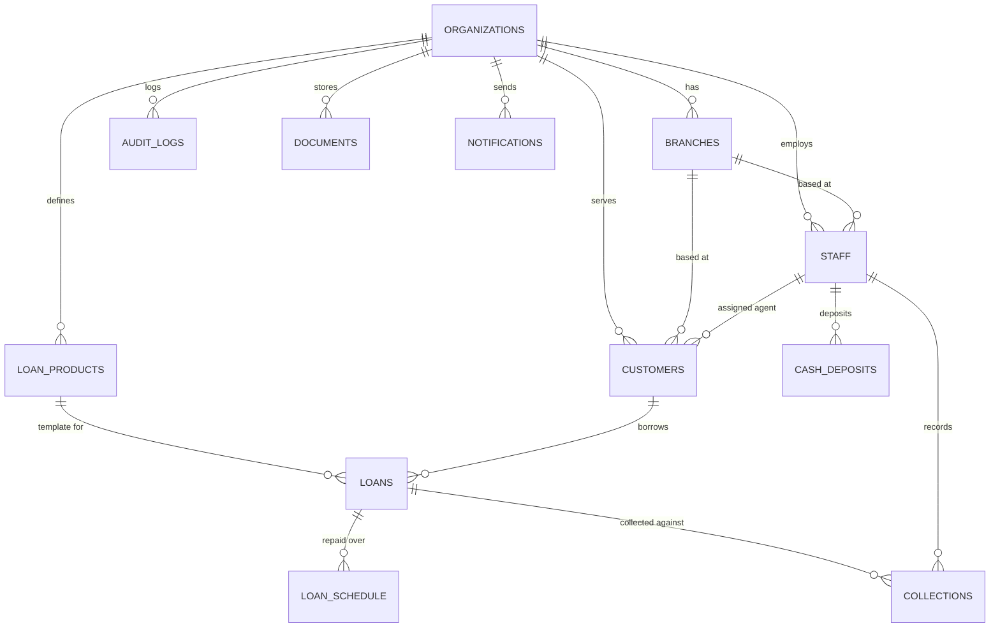

# 03 — Database Schema

Target: PostgreSQL 15+ (Supabase's managed version). All DDL below is ready to run as a Prisma migration or directly via `psql`. Money values use `numeric(12,2)` — never `float`/`double` for currency, to avoid floating-point rounding errors compounding across thousands of collection records.

## 1. Entity-Relationship Overview



Full column-level detail is in the DDL below — treat the DDL, not this diagram, as the source of truth.

## 2. Conventions

- **Primary keys:** `uuid`, generated with `gen_random_uuid()` (built into Postgres 13+ via `pgcrypto`, already enabled on Supabase).
- **Timestamps:** `timestamptz`, always UTC in storage; format for display using `organizations.timezone`.
- **Soft delete:** business entities use `is_active boolean`, not hard deletes — financial records must remain queryable for audit even when "removed" from active use.
- **Money:** `numeric(12,2)`. Never floating point.
- **Every business table** carries `organization_id` for RLS scoping, per `02-architecture-and-tech-stack.md §4`.
- **Naming:** `snake_case` for all SQL identifiers; Prisma's `@@map`/`@map` translate this to `camelCase` in generated TypeScript automatically — you get idiomatic SQL and idiomatic TypeScript from the same schema without a naming compromise in either.

## 3. Enum Types

```sql
create type user_role as enum ('org_admin', 'branch_manager', 'agent', 'accountant');
create type id_proof_type as enum ('aadhaar', 'pan', 'voter_id', 'passport', 'driving_license', 'other');
create type interest_type as enum ('flat', 'reducing_balance');
create type collection_frequency as enum ('daily', 'weekly', 'biweekly', 'monthly');
create type late_fee_type as enum ('flat', 'percentage');
create type loan_status as enum ('pending_approval', 'approved', 'rejected', 'active', 'closed', 'defaulted', 'written_off');
create type schedule_status as enum ('pending', 'partially_paid', 'paid', 'overdue', 'waived');
create type collection_method as enum ('cash', 'cheque', 'other');
create type collection_status as enum ('recorded', 'verified', 'disputed', 'reversed');
create type deposit_status as enum ('pending', 'verified', 'discrepancy');
create type document_related_type as enum ('customer', 'loan', 'collection');
create type notification_recipient_type as enum ('staff', 'customer');
```

## 4. Tables

### 4.1 `organizations`

```sql
create table organizations (
  id uuid primary key default gen_random_uuid(),
  name text not null,
  operator_type text not null default 'organization' check (operator_type in ('individual', 'organization')),
  currency char(3) not null default 'INR',
  timezone text not null default 'Asia/Kolkata',
  contact_email text,
  contact_phone text,
  address text,
  is_active boolean not null default true,
  created_at timestamptz not null default now(),
  updated_at timestamptz not null default now()
);
```

### 4.2 `branches`

```sql
create table branches (
  id uuid primary key default gen_random_uuid(),
  organization_id uuid not null references organizations(id) on delete cascade,
  name text not null,
  address text,
  is_active boolean not null default true,
  created_at timestamptz not null default now(),
  updated_at timestamptz not null default now()
);

create index idx_branches_org on branches(organization_id);
```

### 4.3 `staff`

```sql
create table staff (
  id uuid primary key default gen_random_uuid(),
  organization_id uuid not null references organizations(id) on delete cascade,
  branch_id uuid references branches(id) on delete set null,
  auth_user_id uuid not null unique references auth.users(id) on delete cascade,
  employee_code text,
  full_name text not null,
  email text not null,
  phone text,
  role user_role not null,
  is_active boolean not null default true,
  two_factor_enabled boolean not null default false,
  last_login_at timestamptz,
  created_at timestamptz not null default now(),
  updated_at timestamptz not null default now(),
  unique(organization_id, employee_code)
);

create index idx_staff_org on staff(organization_id);
create index idx_staff_auth_user on staff(auth_user_id);
create index idx_staff_branch on staff(branch_id);
```

`auth_user_id` links to Supabase's managed `auth.users` table — this is how a `staff` row becomes a login-capable identity. Supabase Auth handles password hashing, session issuance, and refresh; this table only holds the business profile and role.

### 4.4 `customers`

```sql
create table customers (
  id uuid primary key default gen_random_uuid(),
  organization_id uuid not null references organizations(id) on delete cascade,
  branch_id uuid references branches(id) on delete set null,
  auth_user_id uuid unique references auth.users(id) on delete set null,
  customer_code text,
  full_name text not null,
  phone text not null,
  email text,
  address text,
  id_proof_type id_proof_type,
  id_proof_number_encrypted bytea,
  date_of_birth date,
  gender text,
  photo_url text,
  guarantor_name text,
  guarantor_phone text,
  assigned_agent_id uuid references staff(id) on delete set null,
  portal_access_enabled boolean not null default false,
  is_active boolean not null default true,
  created_at timestamptz not null default now(),
  updated_at timestamptz not null default now(),
  unique(organization_id, customer_code),
  unique(organization_id, phone)
);

create index idx_customers_org on customers(organization_id);
create index idx_customers_agent on customers(assigned_agent_id);
create index idx_customers_auth_user on customers(auth_user_id);
```

`auth_user_id` is **nullable** here — most customers never log in; it's populated only when a staff member enables portal access (see `04-api-specification.md §5`), which is the point where an `auth.users` row and a Supabase invite email get created for them.

`id_proof_number_encrypted` stores the government ID number encrypted at the application layer (AES-256-GCM, key from environment secrets — see `06-security-architecture.md §5`) rather than as plaintext, since this is the single most sensitive field in the schema.

### 4.5 `loan_products`

```sql
create table loan_products (
  id uuid primary key default gen_random_uuid(),
  organization_id uuid not null references organizations(id) on delete cascade,
  name text not null,
  interest_type interest_type not null,
  interest_rate_annual numeric(6,3) not null check (interest_rate_annual >= 0),
  collection_frequency collection_frequency not null,
  min_amount numeric(12,2) not null check (min_amount > 0),
  max_amount numeric(12,2) not null check (max_amount >= min_amount),
  min_tenure integer not null check (min_tenure > 0),
  max_tenure integer not null check (max_tenure >= min_tenure),
  late_fee_type late_fee_type not null default 'flat',
  late_fee_value numeric(12,2) not null default 0,
  processing_fee numeric(12,2) not null default 0,
  is_active boolean not null default true,
  created_at timestamptz not null default now(),
  updated_at timestamptz not null default now()
);

create index idx_loan_products_org on loan_products(organization_id);
```

### 4.6 `loans`

```sql
create table loans (
  id uuid primary key default gen_random_uuid(),
  organization_id uuid not null references organizations(id) on delete cascade,
  customer_id uuid not null references customers(id) on delete restrict,
  loan_product_id uuid not null references loan_products(id) on delete restrict,
  loan_code text not null,

  -- snapshotted at approval/disbursement so later edits to the product
  -- template never retroactively change an existing loan's terms
  principal_amount numeric(12,2) not null check (principal_amount > 0),
  interest_type interest_type not null,
  interest_rate_annual numeric(6,3) not null,
  collection_frequency collection_frequency not null,
  tenure integer not null check (tenure > 0),

  installment_amount numeric(12,2) not null,
  total_payable numeric(12,2) not null,
  total_collected numeric(12,2) not null default 0,
  outstanding_balance numeric(12,2) not null,

  status loan_status not null default 'pending_approval',
  assigned_agent_id uuid references staff(id) on delete set null,
  applied_by uuid references staff(id) on delete set null,
  approved_by uuid references staff(id) on delete set null,
  approved_at timestamptz,
  rejected_reason text,
  disbursed_by uuid references staff(id) on delete set null,
  disbursed_at timestamptz,
  start_date date,
  expected_end_date date,
  closed_at timestamptz,
  notes text,

  created_at timestamptz not null default now(),
  updated_at timestamptz not null default now(),
  unique(organization_id, loan_code)
);

create index idx_loans_org_status on loans(organization_id, status);
create index idx_loans_customer on loans(customer_id);
create index idx_loans_agent on loans(assigned_agent_id);
```

### 4.7 `loan_schedule`

```sql
create table loan_schedule (
  id uuid primary key default gen_random_uuid(),
  loan_id uuid not null references loans(id) on delete cascade,
  installment_number integer not null check (installment_number > 0),
  due_date date not null,
  principal_component numeric(12,2) not null,
  interest_component numeric(12,2) not null,
  due_amount numeric(12,2) not null,
  paid_amount numeric(12,2) not null default 0,
  status schedule_status not null default 'pending',
  created_at timestamptz not null default now(),
  updated_at timestamptz not null default now(),
  unique(loan_id, installment_number)
);

create index idx_schedule_loan on loan_schedule(loan_id);
create index idx_schedule_due_status on loan_schedule(due_date, status);
```

The `(due_date, status)` index is what makes the overdue report (`04-api-specification.md §10`) a fast indexed scan instead of a full table scan as the schedule table grows into the tens of thousands of rows.

### 4.8 `collections`

```sql
create table collections (
  id uuid primary key default gen_random_uuid(),
  client_generated_id uuid not null unique,
  organization_id uuid not null references organizations(id) on delete cascade,
  loan_id uuid not null references loans(id) on delete restrict,
  customer_id uuid not null references customers(id) on delete restrict,
  collected_by uuid not null references staff(id) on delete restrict,

  amount numeric(12,2) not null check (amount > 0),
  collection_date date not null,
  collected_at timestamptz not null,
  recorded_at timestamptz not null default now(),
  collection_method collection_method not null default 'cash',
  receipt_number text,

  latitude numeric(9,6),
  longitude numeric(9,6),
  photo_url text,
  notes text,

  status collection_status not null default 'recorded',
  reversed_reason text,
  reversed_by uuid references staff(id) on delete set null,
  reversed_at timestamptz,

  created_at timestamptz not null default now(),
  updated_at timestamptz not null default now(),
  unique(organization_id, receipt_number)
);

create index idx_collections_loan on collections(loan_id);
create index idx_collections_org_date on collections(organization_id, collection_date);
create index idx_collections_agent_date on collections(collected_by, collection_date);
```

`client_generated_id` is a UUID generated **on the agent's device** at the moment of collection, before the request ever reaches the server. It's the idempotency key for offline sync: if the agent's device retries a sync after a flaky connection drops the response, the backend upserts on this key instead of creating a duplicate collection record. See `07-frontend-implementation-guide.md §8` and `04-api-specification.md §8`.

`collected_at` vs. `recorded_at`: when an agent records a collection offline and it syncs hours later, these two timestamps diverge — `collected_at` is when the cash actually changed hands (what matters for the schedule and for the customer), `recorded_at` is when the server received it (what matters for sync/audit debugging).

### 4.9 `cash_deposits`

```sql
create table cash_deposits (
  id uuid primary key default gen_random_uuid(),
  organization_id uuid not null references organizations(id) on delete cascade,
  agent_id uuid not null references staff(id) on delete restrict,
  amount numeric(12,2) not null check (amount > 0),
  deposit_date date not null,
  verified_by uuid references staff(id) on delete set null,
  verified_at timestamptz,
  status deposit_status not null default 'pending',
  notes text,
  created_at timestamptz not null default now(),
  updated_at timestamptz not null default now()
);

create index idx_deposits_org_date on cash_deposits(organization_id, deposit_date);
create index idx_deposits_agent on cash_deposits(agent_id);
```

This table is what lets an admin answer "Agent X collected ₹14,200 this week but only deposited ₹11,000 — where's the other ₹3,200?" It's independent of `collections`; reconciliation logic (comparing sum of an agent's collections against sum of their deposits over a period) lives in the reports module, not as a database constraint, since a discrepancy is exactly the thing you need to be *able* to record, not prevent.

### 4.10 `documents`

```sql
create table documents (
  id uuid primary key default gen_random_uuid(),
  organization_id uuid not null references organizations(id) on delete cascade,
  related_entity_type document_related_type not null,
  related_entity_id uuid not null,
  document_type text not null,
  file_path text not null,
  file_size_bytes bigint,
  mime_type text,
  uploaded_by uuid references staff(id) on delete set null,
  created_at timestamptz not null default now()
);

create index idx_documents_entity on documents(related_entity_type, related_entity_id);
```

`file_path` is the path *within* a Supabase Storage bucket (e.g. `kyc-documents/{organization_id}/{customer_id}/aadhaar-front.jpg`), not a public URL — access is brokered through Storage RLS policies (§5) plus signed URLs, never a permanently public link, since these are identity documents.

### 4.11 `notifications`

```sql
create table notifications (
  id uuid primary key default gen_random_uuid(),
  organization_id uuid not null references organizations(id) on delete cascade,
  recipient_type notification_recipient_type not null,
  recipient_staff_id uuid references staff(id) on delete cascade,
  recipient_customer_id uuid references customers(id) on delete cascade,
  type text not null,
  title text not null,
  message text not null,
  related_entity_type text,
  related_entity_id uuid,
  is_read boolean not null default false,
  created_at timestamptz not null default now(),
  constraint chk_notification_recipient check (
    (recipient_type = 'staff' and recipient_staff_id is not null and recipient_customer_id is null)
    or
    (recipient_type = 'customer' and recipient_customer_id is not null and recipient_staff_id is null)
  )
);

create index idx_notifications_staff on notifications(recipient_staff_id, is_read);
create index idx_notifications_customer on notifications(recipient_customer_id, is_read);
```

### 4.12 `audit_logs`

```sql
create table audit_logs (
  id uuid primary key default gen_random_uuid(),
  organization_id uuid not null references organizations(id) on delete cascade,
  actor_staff_id uuid references staff(id) on delete set null,
  action text not null,
  entity_type text not null,
  entity_id uuid not null,
  old_value jsonb,
  new_value jsonb,
  ip_address inet,
  user_agent text,
  created_at timestamptz not null default now()
);

create index idx_audit_org_entity on audit_logs(organization_id, entity_type, entity_id);
create index idx_audit_created on audit_logs(created_at);
```

This table is **insert-only** from the application's perspective — no update or delete policy is granted to any role (see §5). `action` uses a `resource.verb` convention (`loan.approve`, `collection.reverse`, `staff.deactivate`) so it's grep-able. Populated automatically by an interceptor, not by scattered manual calls — see `08-backend-implementation-guide.md §6`.

## 5. Row-Level Security

RLS is enabled on every table above and, given this platform serves many organizations rather than one self-hosted operator, it is treated as a **primary, load-bearing enforcement layer** — not a backstop that trusts application code to get scoping right every time.

**The backend does not use Supabase's default `service_role`.** `service_role` bypasses RLS entirely, which is fine for a single-tenant app but not acceptable here: a scoping bug in application code would have nothing left to catch it. Instead, a dedicated role is created for the backend's pooled connection:

```sql
create role pigmie_app with login password '<stored in Render env vars, not in source>';
grant usage on schema public to pigmie_app;
grant select, insert, update, delete on all tables in schema public to pigmie_app;
grant usage, select on all sequences in schema public to pigmie_app;
alter default privileges in schema public grant select, insert, update, delete on tables to pigmie_app;
```

`pigmie_app` has no `BYPASSRLS` attribute, so every query it runs is still subject to RLS. Since this role isn't authenticated as a Supabase end-user (there's no `auth.uid()` for a backend-to-database connection), the backend explicitly tells Postgres which organization the current request belongs to, once per request, via a session-scoped setting:

```sql
-- executed by the backend at the start of every request's transaction,
-- immediately after resolving organizationId from the caller's verified JWT
select set_config('app.current_org_id', $1, true);  -- true = local to this transaction only
```

A single helper function then makes RLS policies work identically whether the query came from a Supabase-authenticated client session (Auth, Storage) or from the backend's `pigmie_app` connection:

```sql
create or replace function public.current_staff_org_id()
returns uuid
language sql stable security definer set search_path = public as $$
  select organization_id from staff where auth_user_id = auth.uid() and is_active = true;
$$;

create or replace function public.request_organization_id()
returns uuid
language sql stable as $$
  select coalesce(
    public.current_staff_org_id(),                                  -- path 1: direct Supabase client session
    nullif(current_setting('app.current_org_id', true), '')::uuid   -- path 2: backend-mediated, via set_config above
  );
$$;
```

RLS's job here is **tenant isolation** — which organization a row belongs to. Role-based authorization (can *this* agent approve a loan) is the backend's job, enforced by guards before a query ever runs (`08-backend-implementation-guide.md §3, §5`) — that split keeps each layer doing the one thing it's positioned to do well: the database can't know or enforce "is this specific action allowed for an agent," but it can always know and enforce "does this row belong to the caller's organization," and it does so unconditionally, regardless of which code path is asking.

Representative policies (identical pattern across all twelve tables — shown for `customers`, `loans`, and `collections`; the complete set ships in the Prisma migration, not repeated here for length):

```sql
alter table customers enable row level security;

create policy "read customers in your organization"
  on customers for select
  using (organization_id = public.request_organization_id());

create policy "write customers in your organization"
  on customers for insert with check (organization_id = public.request_organization_id());

create policy "update customers in your organization"
  on customers for update
  using (organization_id = public.request_organization_id());

create policy "customers read their own record"
  on customers for select
  using (auth_user_id = auth.uid());
```

```sql
alter table loans enable row level security;

create policy "read loans in your organization"
  on loans for select
  using (organization_id = public.request_organization_id());

create policy "write loans in your organization"
  on loans for insert with check (organization_id = public.request_organization_id());

create policy "update loans in your organization"
  on loans for update
  using (organization_id = public.request_organization_id());

create policy "customers read their own loans"
  on loans for select
  using (customer_id in (select id from customers where auth_user_id = auth.uid()));
```

```sql
alter table collections enable row level security;

create policy "read collections in your organization"
  on collections for select
  using (organization_id = public.request_organization_id());

create policy "insert collections in your organization"
  on collections for insert with check (organization_id = public.request_organization_id());

-- Deliberately no UPDATE/DELETE policy on collections for any role.
-- Corrections happen via POST /collections/:id/reverse, which inserts an
-- offsetting record rather than mutating history — 05-business-logic-and-calculations.md §4.

create policy "customers read collections on their own loans"
  on collections for select
  using (customer_id in (select id from customers where auth_user_id = auth.uid()));
```

**`audit_logs` gets no `update` or `delete` policy under any role, including `org_admin`** — this is intentional. An audit trail that any application role can edit isn't an audit trail. It gets the same `request_organization_id()` `select`/`insert` treatment as every other table above.

**Why this is worth the extra moving part:** with `pigmie_app` stripped of `BYPASSRLS`, forgetting `set_config('app.current_org_id', ...)` at the start of a request doesn't silently return everyone's data — it returns *nothing* (the coalesce falls through to `NULL`, which matches no rows), which fails safe and loud in testing rather than failing open in production. That fail-safe property is the entire reason to accept the added complexity of this pattern over a simpler bypass — see `08-backend-implementation-guide.md §5` for exactly where this executes in the request lifecycle.

## 6. Triggers — Keeping Loan Totals Consistent

```sql
create or replace function public.set_updated_at()
returns trigger language plpgsql as $$
begin
  new.updated_at = now();
  return new;
end;
$$;

-- applied to every table with an updated_at column, e.g.:
create trigger trg_customers_updated_at before update on customers
  for each row execute function public.set_updated_at();
```

```sql
create or replace function public.sync_loan_totals()
returns trigger language plpgsql as $$
declare
  v_loan_id uuid := coalesce(new.loan_id, old.loan_id);
begin
  update loans l
  set total_collected = coalesce((
        select sum(c.amount) from collections c
        where c.loan_id = v_loan_id and c.status in ('recorded', 'verified')
      ), 0),
      updated_at = now()
  where l.id = v_loan_id;

  update loans
  set outstanding_balance = total_payable - total_collected
  where id = v_loan_id;

  return coalesce(new, old);
end;
$$;

create trigger trg_sync_loan_totals
  after insert or update or delete on collections
  for each row execute function public.sync_loan_totals();
```

This trigger guarantees `loans.total_collected` and `loans.outstanding_balance` can never drift from the sum of actual collection rows, no matter which code path wrote them. It deliberately does **not** decide which `loan_schedule` installments a given collection pays off — that allocation logic (oldest-due-first, partial payments, overpayments) is complex enough to need real control flow and unit tests, so it lives in the backend service layer inside a database transaction, not in a trigger. See `05-business-logic-and-calculations.md §4` for the algorithm and `08-backend-implementation-guide.md` for where it's implemented. The trigger is the invariant; the service layer is the policy.

## 7. Migration Strategy

- Prisma is the source of truth for schema changes: `npx prisma migrate dev --name <description>` locally, committed to the repo under `prisma/migrations/`, applied to production with `npx prisma migrate deploy` from the GitHub Actions deploy workflow (`09-deployment-and-testing-guide.md §7`).
- RLS policies and triggers are not natively modeled by Prisma's schema language — they're added via a `migration.sql` edit inside the generated migration folder (Prisma explicitly supports hand-editing the generated SQL before it's applied), so the CREATE POLICY / CREATE TRIGGER statements above ship as part of the normal migration history rather than a separate manual step someone can forget.
- Never run `prisma migrate dev` directly against the production Supabase database — only `migrate deploy`, which doesn't attempt to generate new migrations or prompt interactively.
- `schema.prisma`'s datasource block sets **both** a pooled and a direct URL, because they serve different purposes under real concurrent load: `url = env("DATABASE_URL")` points at Supabase's pooled connection (port `6543`) and is what the running application uses for every request; `directUrl = env("DIRECT_URL")` points at the direct connection (port `5432`) and is what `migrate deploy` uses, since schema-changing DDL should run outside the pooler. Both are documented with exact values in `09-deployment-and-testing-guide.md §9`.

## 8. Watching the 500MB Free-Tier Ceiling

```sql
select pg_size_pretty(pg_database_size(current_database()));
```

Run this monthly (or automate it as a scheduled report). At realistic row sizes, a few hundred customers with a year of daily collections lands well under 500MB — the estimate in `02-architecture-and-tech-stack.md §9` holds for a while — but it costs nothing to check rather than assume.
