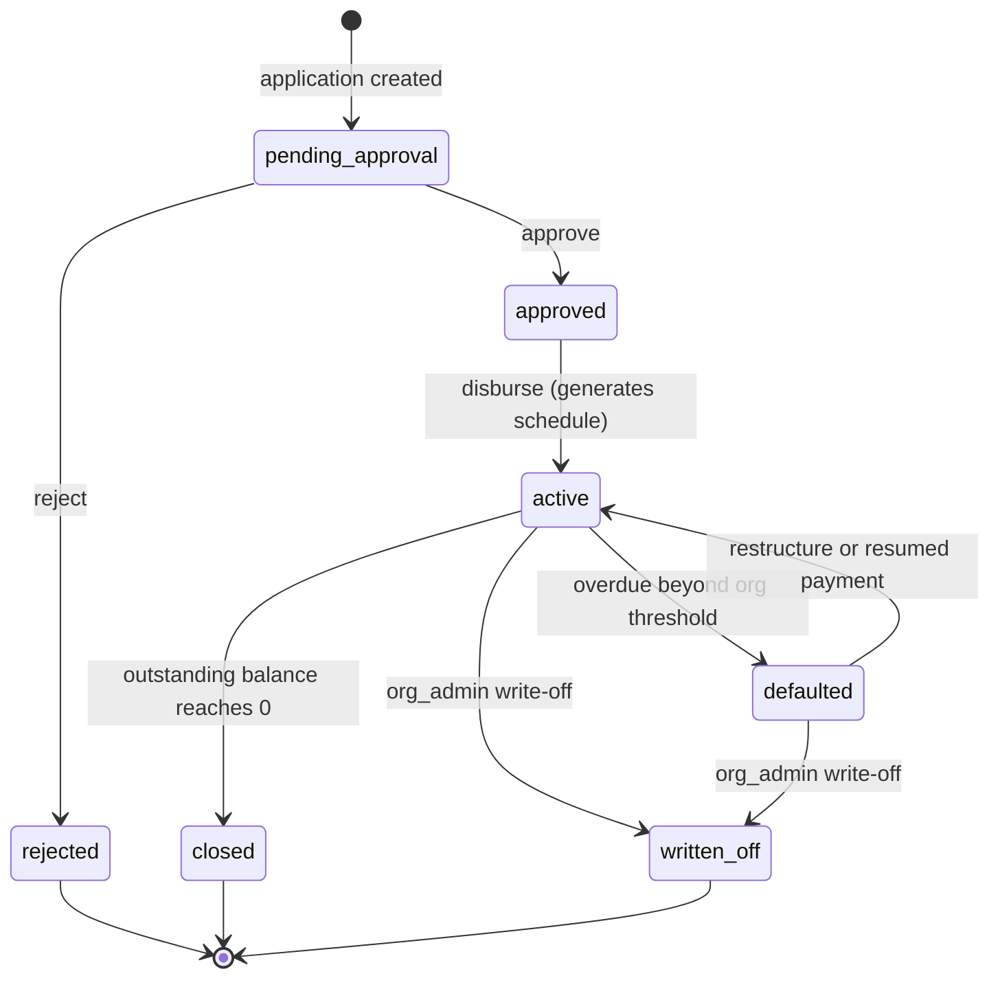

# 05 — Business Logic & Calculations

This is the math and the algorithms that make the schedule, the balances, and the reports correct. Everything here runs in the NestJS backend (never on the client — a customer or agent's device is not a trusted source of truth for what they owe). All worked examples use ₹ per the currency assumption in `01-product-overview-and-scope.md §3`.

## 1. Interest Models

Pigmie supports two interest types, selected per loan product.

### Flat interest
Interest is calculated once on the full original principal for the entire tenure, and doesn't reduce as the balance is repaid.

```
totalInterest = principal × annualRate × tenureInYears
totalPayable  = principal + totalInterest
installmentAmount = totalPayable / tenure
```

### Reducing balance interest
Interest is calculated each period on whatever principal is still outstanding, so it shrinks over the life of the loan — this is the fairer model to the borrower and the one most microfinance regulators expect for anything resembling formal lending.

```
periodicRate = annualRate / periodsPerYear(frequency)
installmentAmount = principal × periodicRate × (1 + periodicRate)^tenure
                     ──────────────────────────────────────────────
                              (1 + periodicRate)^tenure − 1
```

Where `periodsPerYear` maps from `collectionFrequency`:

| Frequency | periodsPerYear |
|---|---|
| daily | 365 |
| weekly | 52 |
| biweekly | 26 |
| monthly | 12 |

**Worked example — monthly, reducing balance:** Principal ₹10,000, annual rate 24%, tenure 10 months.
`periodicRate = 0.24 / 12 = 0.02`. `(1.02)^10 ≈ 1.21899`.
`installmentAmount = 10000 × 0.02 × 1.21899 / 0.21899 ≈ ₹1,113.32/month`.
Total payable ≈ ₹11,133.20; total interest ≈ ₹1,133.20.

**Same loan, flat interest, for comparison:** `totalInterest = 10000 × 0.24 × (10/12) = ₹2,000`. `installmentAmount = 12000 / 10 = ₹1,200/month`. Flat interest costs this borrower ₹866.80 more than reducing balance for the "same" 24% rate — this is worth surfacing in the UI wherever a rate is entered, since it's the single most common source of borrower confusion/dispute in this industry.

**Worked example — daily, reducing balance (the more typical Pigmie case):** Principal ₹5,000, annual rate 30%, tenure 100 days.
`periodicRate = 0.30 / 365 ≈ 0.00082192`. `(1.00082192)^100 ≈ 1.085625`.
`installmentAmount ≈ 5000 × 0.00082192 × 1.085625 / 0.085625 ≈ ₹52.12/day`.
Total payable ≈ ₹5,212; total interest ≈ ₹212 over the 100-day term.

## 2. Rounding — a Real Constraint for Cash Collection

Unlike a digital-payment system, an agent collecting physical cash can't practically handle fractional paise. Round `installmentAmount` (and the per-row `principalComponent`/`interestComponent`) to whole currency units, or to the organization's preferred cash denomination (nearest ₹1 or ₹5, configurable, defaulting to ₹1). Rounding will not divide evenly across every installment — **the last installment in the schedule absorbs the residual difference** so that the sum of all installments always equals `totalPayable` exactly. This is implemented in the schedule generator below, not left as a reconciliation problem for later.

## 3. Schedule Generation

Runs once, inside the transaction that disburses a loan (`POST /loans/:id/disburse`), never regenerated afterward except by an explicit restructure (§10).

```
function generateSchedule(principal, interestType, annualRate, tenure, frequency, startDate):
    periodicRate = annualRate / periodsPerYear(frequency)
    rows = []

    if interestType == 'flat':
        totalInterest = principal * annualRate * (tenure / periodsPerYear(frequency))
        totalPayable = principal + totalInterest
        emi = round(totalPayable / tenure)
        principalPerRow = round(principal / tenure)
        interestPerRow = round(totalInterest / tenure)

        for i in 1..tenure:
            dueDate = addPeriods(startDate, i, frequency)
            if i < tenure:
                rows.push({ i, dueDate, principalPerRow, interestPerRow, dueAmount: emi })
            else:
                # final row absorbs rounding drift on both components
                paidPrincipalSoFar = principalPerRow * (tenure - 1)
                paidInterestSoFar = interestPerRow * (tenure - 1)
                rows.push({
                    i, dueDate,
                    principalComponent: principal - paidPrincipalSoFar,
                    interestComponent: totalInterest - paidInterestSoFar,
                    dueAmount: totalPayable - (emi * (tenure - 1))
                })

    else: # reducing_balance
        emi = calculateReducingBalanceEMI(principal, periodicRate, tenure)  # formula in §1
        balance = principal

        for i in 1..tenure:
            dueDate = addPeriods(startDate, i, frequency)
            interestComponent = round(balance * periodicRate)
            if i < tenure:
                principalComponent = round(emi - interestComponent)
                dueAmount = emi
            else:
                # final row: whatever principal remains, exactly
                principalComponent = balance
                dueAmount = principalComponent + interestComponent
            rows.push({ i, dueDate, principalComponent, interestComponent, dueAmount })
            balance -= principalComponent

    return rows
```

`addPeriods(startDate, i, frequency)` adds `i` days/weeks/2-weeks/months depending on frequency. For `monthly`, use calendar-month arithmetic (not "30 days") so due dates land on a sensible day each month.

Each row from this function becomes one `loan_schedule` insert. `totalPayable` (sum of all `dueAmount`) is stored on the `loans` row itself at disbursement time, alongside the computed `installmentAmount`.

## 4. Applying a Collection to the Schedule

This is the allocation logic referenced from `03-database-schema.md §6` — deliberately implemented in the service layer inside a transaction, not a database trigger, because it needs real control flow.

```
function applyCollectionToSchedule(loanId, amount):
    remaining = amount
    rows = getScheduleRows(loanId, status IN ('pending', 'partially_paid', 'overdue'), ORDER BY installmentNumber ASC)

    for row in rows:
        if remaining <= 0: break
        owedOnRow = row.dueAmount - row.paidAmount
        applied = min(remaining, owedOnRow)
        row.paidAmount += applied
        remaining -= applied
        row.status = (row.paidAmount >= row.dueAmount) ? 'paid' : 'partially_paid'
        save(row)

    if remaining > 0:
        # Overpayment: credit forward against not-yet-due installments, same rule.
        futureRows = getScheduleRows(loanId, status = 'pending', dueDate > today, ORDER BY installmentNumber ASC)
        for row in futureRows:
            if remaining <= 0: break
            applied = min(remaining, row.dueAmount)
            row.paidAmount += applied
            remaining -= applied
            row.status = (row.paidAmount >= row.dueAmount) ? 'paid' : 'partially_paid'
            save(row)

    if remaining > 0:
        # The whole schedule is now paid off and there's still money left over —
        # a genuine overpayment beyond the loan. Do not silently discard it:
        # flag on the loan record for admin review rather than guess intent.
        flagLoanForReview(loanId, reason: 'overpayment_beyond_schedule', amount: remaining)

    return rows
```

**Oldest-due-first** is the default allocation policy: the earliest unpaid installment gets paid before any later one, regardless of which specific installment the customer might think they're paying for. This matches how these operators actually think about the ledger and keeps "days overdue" calculations simple and unambiguous (an installment is overdue exactly when today > its due date and it isn't fully paid — no separate bookkeeping needed for "which payment was skipped").

**Partial payments are allowed by design**, not treated as an error — a customer handing over less than the full installment is completely normal in this business, and the schedule row's `partially_paid` status plus `paidAmount` tracks exactly how much is still owed on it.

## 5. Late Fees

Applied by the daily overdue-detection job (§9), not at collection time. When a `loan_schedule` row transitions into `overdue` and its loan product has `lateFeeValue > 0`:

```
function calculateLateFee(row, product):
    if product.lateFeeType == 'flat':
        return product.lateFeeValue
    else: # percentage
        return round(row.dueAmount * (product.lateFeeValue / 100))
```

The fee is **added to that row's `dueAmount`** (so it becomes part of what's owed and flows through the same collection-allocation logic in §4), and the adjustment is written to `audit_logs` with the before/after `dueAmount` so it's always traceable. Late fees are applied once per installment transition into overdue — not compounded daily — which is both the simpler and the more borrower-fair implementation; a daily-compounding late fee model is easy to construct accidentally by re-running the job's fee logic on already-overdue rows, so the job explicitly checks `status was pending/partially_paid, now overdue` (a transition) rather than `status = overdue` (a state) before applying a fee.

## 6. Loan Status State Machine



Every transition is a distinct API endpoint (`04-api-specification.md §8`), not a generic `PATCH status`, so each one can carry its own authorization rule and its own audit log action name. `active → defaulted` is the one automatic transition (fired by the same daily job as §9, using an organization-configurable "days overdue" threshold, sensible default 90 days) — every other transition is a deliberate staff action.

## 7. Portfolio at Risk (PAR)

The standard micro-finance risk metric — the share of the total outstanding portfolio sitting in loans with an overdue installment past a given threshold.

```
PAR(n) = Σ(outstandingBalance of loans with at least one schedule row overdue by more than n days)
         ────────────────────────────────────────────────────────────────────────────────────────
                          Σ(outstandingBalance of all active loans)
```

Reported at the conventional 1/30/90-day thresholds. As SQL:

```sql
select
  sum(case when overdue_days > 30 then l.outstanding_balance else 0 end) /
  nullif(sum(l.outstanding_balance), 0) as par_30
from loans l
join lateral (
  select coalesce(max(current_date - due_date), 0) as overdue_days
  from loan_schedule s
  where s.loan_id = l.id and s.status in ('pending', 'partially_paid', 'overdue')
) x on true
where l.status = 'active' and l.organization_id = :orgId;
```

## 8. Collection Efficiency

```
collectionEfficiency(period) = Σ(collections.amount recorded/verified in period)
                                ───────────────────────────────────────────────  × 100%
                                Σ(loan_schedule.dueAmount with dueDate in period)
```

Reported overall and grouped by agent/branch/day (`GET /reports/collection-efficiency`) — this, together with PAR, is the pair of numbers a lender actually runs the operation by, per `01-product-overview-and-scope.md §7`.

## 9. Overdue Detection (scheduled job)

Runs once daily, early morning in the organization's configured timezone (`08-backend-implementation-guide.md §7` for the actual NestJS `@Cron` implementation):

```
function markOverdueInstallments():
    for row in loan_schedule where status in ('pending', 'partially_paid') and due_date < today:
        previousStatus = row.status
        row.status = 'overdue'
        save(row)
        if product.lateFeeValue > 0:
            fee = calculateLateFee(row, product)          # §5
            row.dueAmount += fee
            save(row)
            writeAuditLog('schedule.late_fee_applied', row, { before: ..., after: ... })

    for loan in loans where status = 'active':
        maxOverdueDays = max(today - row.dueDate for row in loan.schedule where row.status = 'overdue')
        if maxOverdueDays > organization.defaultDaysThreshold:  # default 90
            loan.status = 'defaulted'
            save(loan)
            writeAuditLog('loan.auto_default', loan)
            notify(loan.assignedAgent, 'loan_defaulted')
```

## 10. Loan Restructuring

Triggered by `POST /loans/:id/restructure` (Phase 3). Given a `fromInstallmentNumber` and a `newTenure`:

```
function restructureLoan(loanId, fromInstallmentNumber, newTenure, reason):
    paidRows = getScheduleRows(loanId, installmentNumber < fromInstallmentNumber)
    remainingPrincipal = loan.principalAmount - sum(row.principalComponent for row in paidRows where row.status = 'paid')
    # simplification: any partially-paid row at the boundary is fully resolved
    # (its remaining owed amount folded into remainingPrincipal) before regenerating

    newSchedule = generateSchedule(
        principal: remainingPrincipal,
        interestType: loan.interestType,
        annualRate: loan.interestRateAnnual,
        tenure: newTenure,
        frequency: loan.collectionFrequency,
        startDate: today
    )

    beginTransaction:
        deleteScheduleRows(loanId, installmentNumber >= fromInstallmentNumber)
        renumberAndInsert(newSchedule, startingAt: fromInstallmentNumber)
        loan.tenure = fromInstallmentNumber - 1 + newTenure
        loan.totalPayable = sum(paidRows.dueAmount) + sum(newSchedule.dueAmount)
        loan.expectedEndDate = last(newSchedule).dueDate
        save(loan)
        writeAuditLog('loan.restructure', loan, { reason, oldScheduleTail: ..., newScheduleTail: newSchedule })
    commitTransaction
```

Restructuring never touches already-paid schedule rows and always writes a full audit trail of what the tail of the schedule looked like before and after — a restructure is exactly the kind of event a customer or auditor will ask about later.
